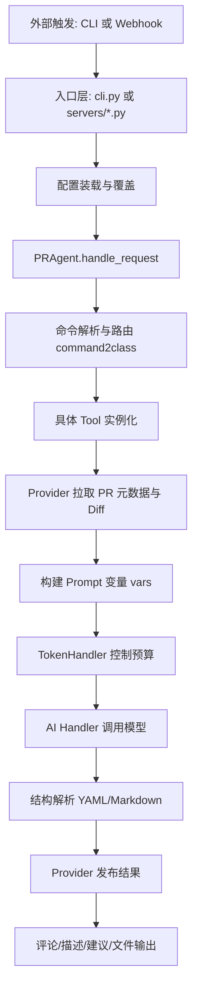

# PR-Agent 项目深度说明（面向测试设计）

## 1. 项目定位与目标

PR-Agent 是一个面向 Pull Request 全流程的 AI 代理系统，核心能力是对代码变更进行自动描述、审查、改进建议与问答。它支持多种 Git 平台（GitHub、GitLab、Bitbucket、Azure DevOps、Gitea 等），并支持多种运行方式（CLI、Webhook/App、GitHub Action、本地 diff 模式）。

从测试视角看，PR-Agent 可以抽象为四层：

1. 调度层（入口与路由）：接收外部触发（命令/Webhook），分派工具。
2. 提供层（Provider）：统一访问不同 Git 平台的数据与发布能力。
3. 能力层（Tools）：review/describe/improve/ask 等业务逻辑。
4. 模型层（AI Handler）：统一对接模型与回退策略。

## 2. 主要功能矩阵

### 2.1 核心命令

- /review：生成风险与质量审查结果。
- /describe：生成 PR 标题、摘要与变更说明。
- /improve：生成可执行的代码改进建议。
- /ask：针对 PR 上下文问答。
- /update_changelog、/generate_labels、/add_docs 等扩展命令。

### 2.2 支持的触发方式

- CLI：本地执行命令。
- Webhook/App：由平台事件触发（PR 打开、评论、同步等）。
- Plain Diff 模式：直接读取 unified diff 文本，不依赖托管平台。
- Local Git 模式：以本地分支差异模拟 PR。

## 3. 核心实现架构

## 3.1 调度与命令路由

核心入口在 pr_agent/agent/pr_agent.py：

- command2class 映射将 action 映射到具体 Tool 类。
- handle_request 会先加载仓库配置，再解析命令与参数，再执行工具 run()。
- 通过统一的异常处理返回执行成功与否。

设计价值：

- 将“命令解释”与“业务执行”解耦。
- 对 CLI、Webhook、自动命令使用同一执行主干。

## 3.2 配置体系

配置入口在 pr_agent/config_loader.py 与 pr_agent/git_providers/utils.py：

- 全局默认配置来自 pr_agent/settings/ 下多个 toml。
- 支持环境变量覆盖。
- 支持仓库级 .pr_agent.toml 覆盖。
- 支持额外远程配置文件（extra_config_url），并带安全限制与大小限制。

配置优先级（简化）：

1. 全局默认
2. 额外配置
3. 仓库配置
4. 环境变量（最终优先）

## 3.3 Provider 抽象层

Provider 封装不同平台的差异：

- 获取 PR 元数据、变更文件、评论、标签。
- 发布输出（评论、描述、建议、标签等）。
- 暴露能力探测 is_supported()，让上层按能力而非平台类型分支。

这层是“调度接口测试”的核心对象之一，因为所有工具执行都依赖它的数据与发布路径。

## 3.4 Tool 能力层

典型实现：

- PRReviewer：审查输出。
- PRDescription：描述输出。
- PRCodeSuggestions：改进建议输出。

共同模式：

1. 从 Provider 拉取上下文（标题、描述、diff、提交信息等）。
2. 组装 vars（模板变量）。
3. TokenHandler 计算并控制 prompt + diff token 预算。
4. 调用 AI Handler 获取响应（支持 fallback models）。
5. 将响应 YAML/文本解析为结构化结果。
6. 渲染 Markdown 并通过 Provider 发布。

## 3.5 AI Handler 与模型回退

默认走 LiteLLM handler，支持多模型与回退链路。测试时应把“模型调用不可用/超时/返回结构异常”视为关键异常路径。

## 4. 端到端数据流（详细）

## 5. 关键运行模式（测试相关）

## 5.1 CLI 模式

入口在 pr_agent/cli.py。

特点：

- 适合离线回放与可控实验。
- 支持 plain-diff 输入，方便固定数据集评测。

## 5.2 Webhook 模式

GitHub/GitLab 等入口在 pr_agent/servers/。

特点：

- 涉及签名校验、事件过滤、身份校验、自动命令触发。
- 适合接口层稳定性与安全性测试。

## 5.3 Plain Diff 模式

实现见 pr_agent/git_providers/plain_diff_provider.py。

特点：

- 直接吃 unified diff 文本。
- 可输出到 stdout 或文件。
- 最适合你要做的 Benchmark/GT 评测流程，因为输入可完全固化与复现。

## 5.4 Local Git 模式

实现见 pr_agent/git_providers/local_git_provider.py。

特点：

- 不依赖线上 PR。
- 输出落地到本地 markdown 文件（review.md/description.md/improve.md）。

## 6. 测试资产现状

现有 tests 目录已经具备较完整基础：

- tests/unittest：大量核心逻辑、provider、配置安全、diff 处理测试。
- tests/e2e_tests：平台级联调场景。
- tests/health_test：describe/review/improve 的健康检查主链路。

这意味着你的新测试体系不需要从 0 开始，可复用已有 fixture、mock 思路与执行方式。

## 7. 你后续两类测试与本项目映射

## 7.1 调度层接口测试

重点覆盖：

- 命令解析与路由是否正确。
- Webhook 事件过滤与安全校验。
- 配置优先级与覆盖行为是否符合预期。
- 失败路径是否稳定返回并有可观测日志。

## 7.2 质量评测（GT 与外接 LLM Judge）

重点覆盖：

- 在固定输入下，输出稳定性与可解析性。
- 与 GT 的语义/结构匹配指标。
- LLM-as-judge 的一致性、偏差控制、可追溯解释。

## 8. 风险与注意点

1. 模型非确定性：同一输入多次输出可能有波动，评测要考虑统计区间。
2. Provider 差异：不同平台 markdown 能力与评论能力不同，评分时需归一化。
3. 配置泄漏风险：评测脚本要显式记录生效配置，避免隐式环境变量污染。
4. Token 截断影响：大 diff 场景可能触发压缩，需单独统计覆盖率和遗漏文件。

## 9. 面向你测试规划的建议结论

1. 将“接口调度正确性”与“内容质量评分”彻底解耦。
2. 质量评测优先采用 plain-diff 固定输入，保证可复现。
3. 同时保留少量 webhook 集成样例作为调度层回归冒烟。
4. 所有评测结果应包含元数据：模型、配置快照、时间、输入哈希、版本号。

---

本文件用于测试前的系统认知统一，不包含任何测试实现代码。